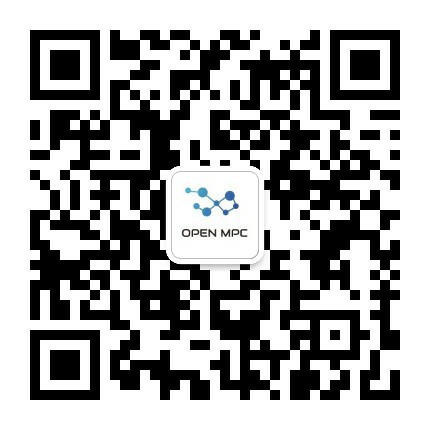

# OpenMPC社区
## 一、社区介绍
- 英文：OpenMPC
- 中文：开放隐私计算社区
- slogan：隐私计算最后一公里的服务区

- 社区简介：
OpenMPC是国内第一个影响力最大的隐私计算开放社区，是一群密码极客的超级俱乐部。社区秉承开放共享的社区精神，专注于隐私计算行业的研究与布道，包括核心技术理论、主流开源框架、技术厂商与产品、行业解决方案等。社区成员已覆盖国内最顶尖的技术大牛、行业大 V、知名学者、资深专家，这里可以得到任何您需要的隐私计算干货。社区致力于隐私计算技术的传播，愿成为中国“隐私计算最后一公里的服务区”。

## 二、开放组织结构

目前我们的成立了多个小组，协助社区的管理和运营，有

- 兴趣小组：[yankaili2006](https://github.com/yankaili2006), [Cryptographer63](https://github.com/Cryptographer63), ...
- 翻译小组：[yankaili2006](https://github.com/yankaili2006), [Cryptographer63](https://github.com/Cryptographer63), ...
- 审稿发稿小组：[yankaili2006](https://github.com/yankaili2006), [Cryptographer63](https://github.com/Cryptographer63), ...

欢迎加入。

## 商业合作

为了社区更好发展和更大产出，我们欢迎各种形式的赞助和合作咨询，收入将用于社区发展。

欢迎加入我们，欢迎关注我们的公众号

 
